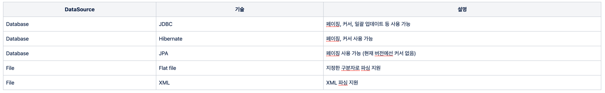
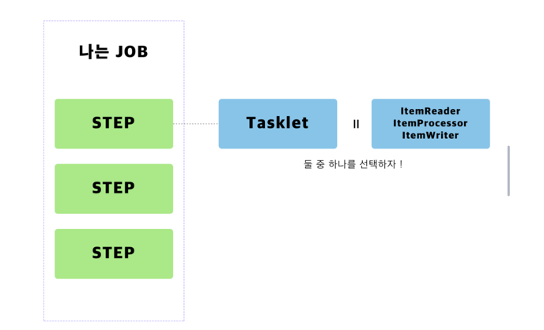
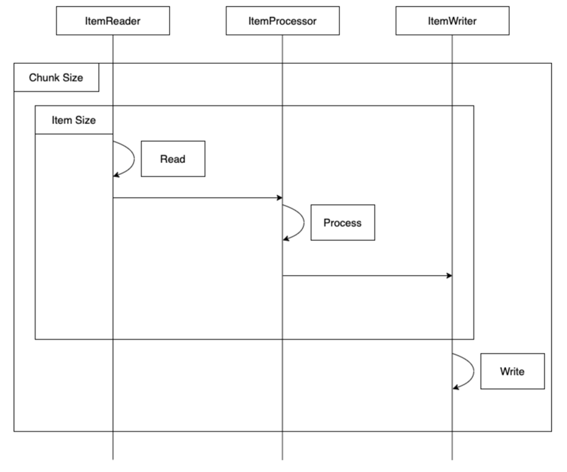

# Spring Batch 구성


## Spring Batch 이전에는 어떻게 했을까?

Spring Batch 이전 스케쥴링 작업은 Scheduler, Quartz 등으로 Spring에서 Annotation으로 선언하여, 지정된 시간에 스케줄링을 돌려 구현 해놓은 클래스를 호출하여 로직을 실행했었다.

## 굳이 Spring Batch를 검토해야하는 까닭은 무엇인가?

기존 스케쥴링 방식으로는 대용량 데이터를 처리하는 도중 에러가 발생하면 처리했던 모든 데이터를 롤백시키고, 다시 처음부터 처리해야했다.

몇 번째 데이터에서 에러가 발생했는지, 해당 배치 로직이 성공했는지 실패했는지 로그처리를 하여 확인해야하는 불편함이 있다.

애초에 비교 대상이 아닌 Quartz

Batch는 대용량 데이터를 일괄적으로 처리하는 기능이고, Quartz는 스케줄링 역할이다.

## Spring Batch는 어디서 나왔는가?

Spring Batch 프로젝트는 Accenture와 Spring Source의 공동 작업으로 2007년에 탄생했다.

Accenture는 수년간의 노력으로 그들만의 배치 프레임워크를 만들었고, 그를 통해 얻은 경험을 가지고 있었다.

즉, Accenture의 배치 노하우 & 기술력과 Spring 프레임워크가 합쳐져 만들어진 것이 Spring Batch 이다.

Spring Batch는 Spring의 특성을 그대로 가져왔다.

그래서 DI, AOP, 서비스 추상화 등 Spring 프레임워크의 3대 요소를 모두 사용할 수 있으면서, Accenture의 Batch 노하우가 담긴 아키텍처를 사용할 수 있다.

## 그래서, Spring Batch는 뭐하는 녀석인가?

Spring에서 지원하는 대용량 데이터를 일괄적으로 처리하는 기능이다.

schema-mysql.sql 을 통해 Spring Batch Meta 정보 관련 Database table 생성

## 들어가기 전, 무슨 개념이 사용하는지 알아보자!

chunk, page 개념을 사용하고 있다.

page : 처리할 데이터 중 일정 개수만큼 조회

chunk : 조회된 데이터를 일정 개수만큼 처리 후 입력

세팅은 page = chunk * n 으로 세팅해야 성능적으로 가장 좋다고 한다.

보편적으로는 page = chunk

## 현재 지원하는 Reader & Writer

현재 Spring Batch 4.0 (Spring Boot 2.0) 에서 지원하는 Reader & Writer는 아래와 같다.

(Reader는 데이터를 읽어오는 모듈이며, Writer는 데이터를 쓰는 모듈이라고 생각하면 된다.)

 - iBatis 모듈은 현재 삭제되었다.

- iBatis를 reader로 사용하셨던 분들은 JDBC ItemReader로 교체하길 추천한다.

## Job
- Spring Batch가 해야할 작업 중 가장 큰 범위를 나타낸다.
- Bean을 통해 Job을 등록시킨 후, Spring Boot 실행 시 간단한 Parameter 설정을 통해 원하는 Job을 실행시킬 수 있다.
```
@Bean
public Job jpaPagingItemReaderJob() {
    return jobBuilderFactory.get("jpaPagingItemReaderJob")
                       .start(jpaPagingItemReaderStep())
                        .build();
}
```


## 특징

- N개의 Job을 생성할 수 있다.

- 1개의 Job은 N개의 Step을 포함할 수 있다.

- 1개의 Step은 Tasklet or (Reader, Processor, Writer)를 포함할 수 있다.

## JOB-STEP

- Step은 실제 Batch 작업을 수행하는 역할을 한다.

- Batch의 비지니스 로직(log.info())을 처리하는 기능은 Step에 구현되어 있다.

- 즉, Batch로 실제 처리하고자 하는 기능과 설정을 모두 포함하는 장소가 Step 이라고 할 수 있다.

## JOB-FLOW: 조건 별 흐름제어

- JOB 에서는 어떻게 조건 별로 Step을 제어하는지를 알아보자.

- next
  - Job에서 Next 설정을 통해 순차적으로 Step을 실행시킬 수 있다.

  - start

    - Job Flow의 첫 번재 step을 시작

  - next

    - start 이후의 작업을 실행
```
jobBuilderFactory.get("stepNextJob")
.start(step1())
.next(step2())
.next(step3())
.build();
```


- from, on, to, end

  - 다양한 설정을 통해 step 분기를 설정할 수 있다. 

  - from, on 으로 분기 조건(if)을 설정하고, to, end로 if-else의 분기를 태운다.

```
jobBuilderFactory.get("deciderJob")
.start(startStep())
.next(decider()) // 홀수 | 짝수 구분
.from(decider()) // decider의 상태가
.on("ODD") // ODD라면
.to(oddStep()) // oddStep로 간다.
.from(decider()) // decider의 상태가
.on("EVEN") // EVEN라면
.to(evenStep()) // evenStep로 간다.
.end() // builder 종료
.build();
```

## Parameter

- Spring Batch의 경우, 외부 혹은 내부에서 파라미터를 받아 여러 Batch 컴포넌트에서 사용할 수 있게 지원하고 있다.

- 이 파라미터를 Job Parameter라고 한다.

- JobScope, StepScope를 설정하여 Parameter Lazy Loading 할 수 있다.
```
@Bean
public Job simpleJob() {
return jobBuilderFactory.get("simpleJob")
.start(simpleStep1(null))
.next(simpleStep2(null))
.build();
}

@Bean
@JobScope
public Step simpleStep1(@Value("#{jobParameters[requestDate]}") String requestDate) {
return stepBuilderFactory.get("simpleStep1")
.tasklet((contribution, chunkContext) -> {
throw new IllegalArgumentException("step1에서 실패했다.");
})
.build();
}
```


- java jar로 배포할 때 파라미터 설정한다.

```
java -jar ... requestDate=20201010
```

## Tasklet (기능)

- Step의 Task를 Simple하게 구현할 수 있다.

- tasklet은 그냥 일반적인 Component라고 생각하시면 된다. 개발자가 이 STEP에서 하고 싶은 내용을 자유롭게 만들 수 있다.

```
	stepBuilderFactory.get("simpleStep2")
                .tasklet((contribution, chunkContext) ->{
                    log.info(">>>>>>> This is Step2");
                    log.info(">>>>>>> requestDate ={}", requestDate);
                    return RepeatStatus.FINISHED;
                })
                .build();
```

## Reader, Processor, Writer

- Step의 Task를 Reader, Processor, Writer 3가지로 나누어 구현할 수 있다.

```
	stepBuilderFactory.get("jdbcBatchItemWriterStep")
                .<People, People>chunk(chunkSize)
                .reader(mybatisBatchItemWriterReader())
                .processor(mybatisCompositeProcessor())  // not required
                .writer(mybatisBatchItemWriter())
                .build();
```

## 1. Reader

- 데이터 조회하는 메소드

```
new MyBatisPagingItemReaderBuilder<People>()
.sqlSessionFactory(sqlSessionFactory)
.queryId("net.newploy.payroll.batch.mapper.PeopleMapper.selectById")
.parameterValues(datesParameters)
.pageSize(chunkSize)
.build(); 
```

- 데이터 조회 타입

  - CursorItemReader : stream 방식으로 1건씩 처리

  - PagingItemReader : page size만큼 조회하여 처리

## 2. Processor ( 필수 아님 )

- 데이터 처리하는 메소드

```
person -> {
            log.info("안녕하세요. "+ person.getFirstName() + "입니다.");
            return person;
        }
```

- 프로세스 처리 타입

  - ItemProcessorAdapter : 거의 사용하지 않는다고 함

  - ValidatingItemProcessor: validate 처리 거의 사용하지 않는다고 함

  - CompositeItemProcessor: 프로세스를 체인닝 처리하여 순차적 진행

## 3. Writer

- 데이터 저장하는 메소드

```
	new MyBatisBatchItemWriterBuilder<People>()
                .sqlSessionFactory(sqlSessionFactory)
                .statementId("net.newploy.payroll.batch.mapper.PeopleMapper.insert")
                .itemToParameterConverter(createItemToParameterMapConverter(1))
                .build();
```


## Batch Flow ( Cursor 기준 )

- Data total : 100 / PageSize : 50 / ChunkSize : 10

  - ItemReader에서 PageSize만큼 조회 ( 50개 조회 )

  - 데이터 처리 시작 ( 10개 )

  - ItemReader에서 ItemProcessor로 1건 씩 넘겨준다.

  - ChunkSize만큼 ItemProcessor에서 1건 씩 처리 ( 10개 처리 )

  - ItemWriter로 처리한 데이터 리스트로 전달 ( 10개 전달 )

  - ItemWriter에서 10개 입력 처리

  - “2 ~ 6” 5회 반복

  - “ 1 “ 처리하여 데이터 조회

  - “ 2 ~ 6 “ 5회 반복

  - End



